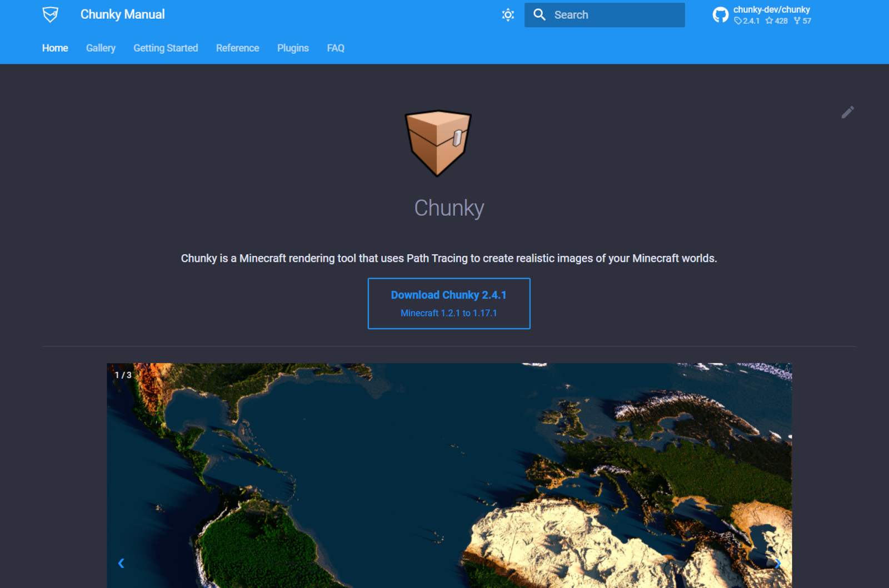

<h1 align="center"> 404 </h1>

	The page you are looking for no longer exists.

	We are in the process of migrating all docs to the new Chunky website so some things might be broken.

---

<h2 align="center">	
	To the new site
</h2>

[Return to jackjt8's Guide](https://jackjt8.github.io/ChunkyGuide/){: .btn }
