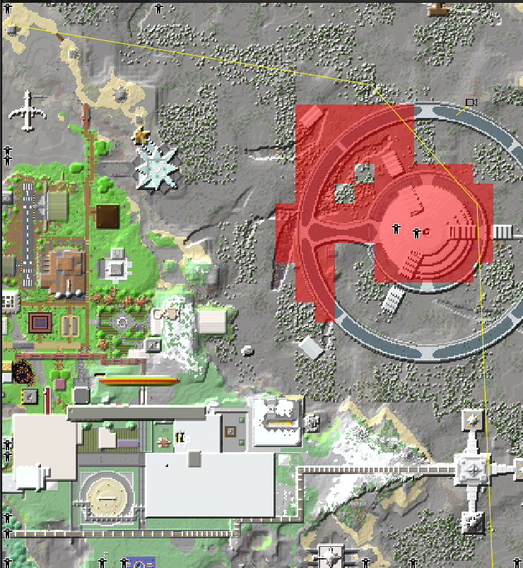
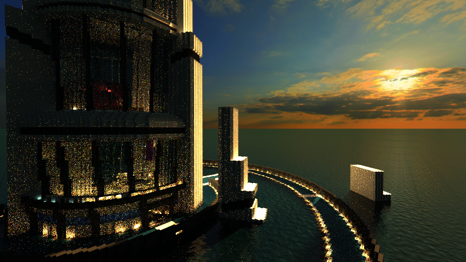
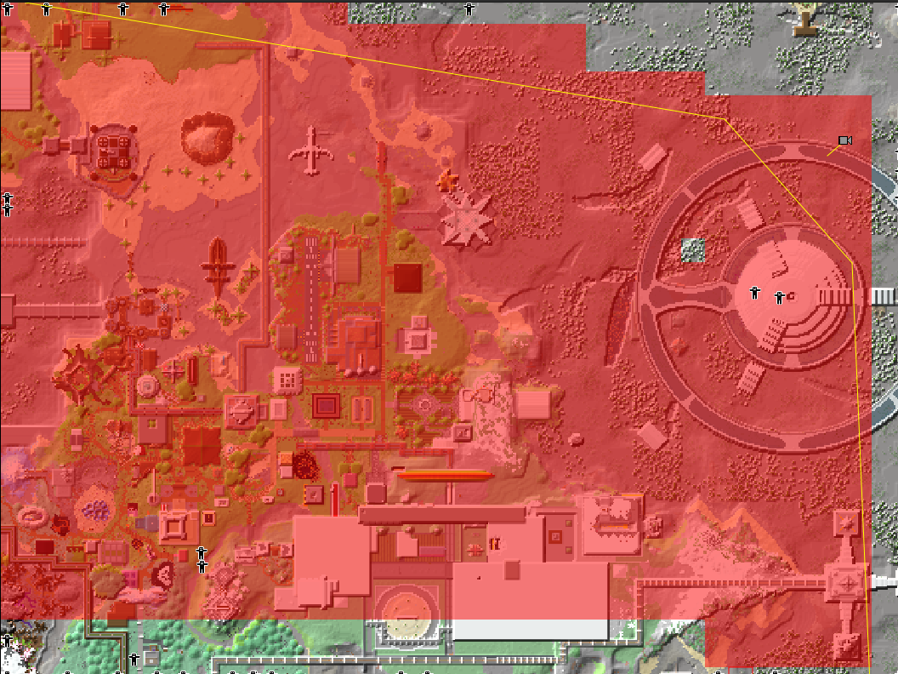
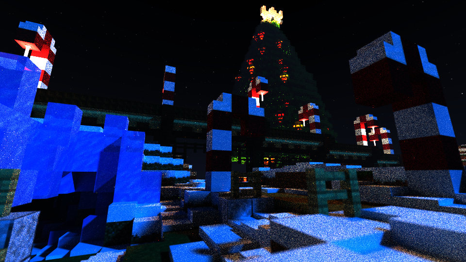
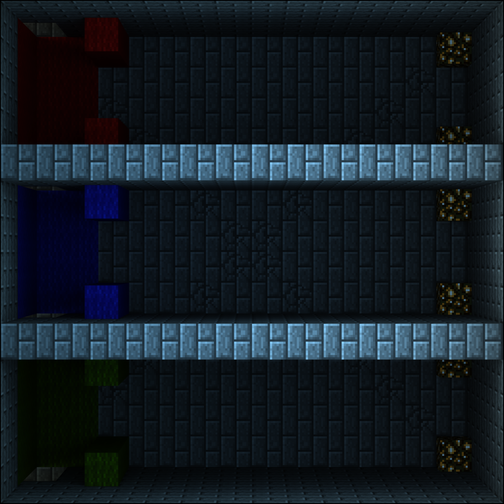
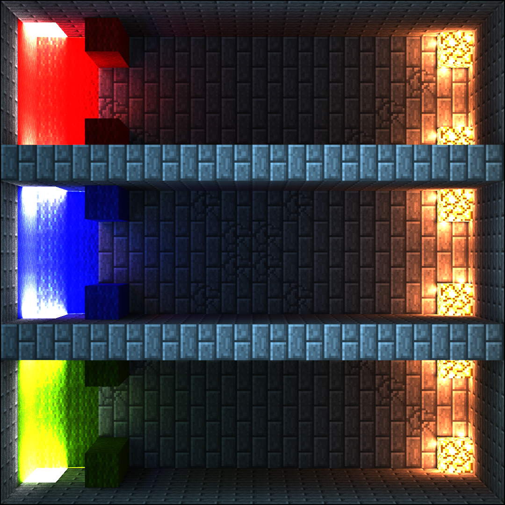
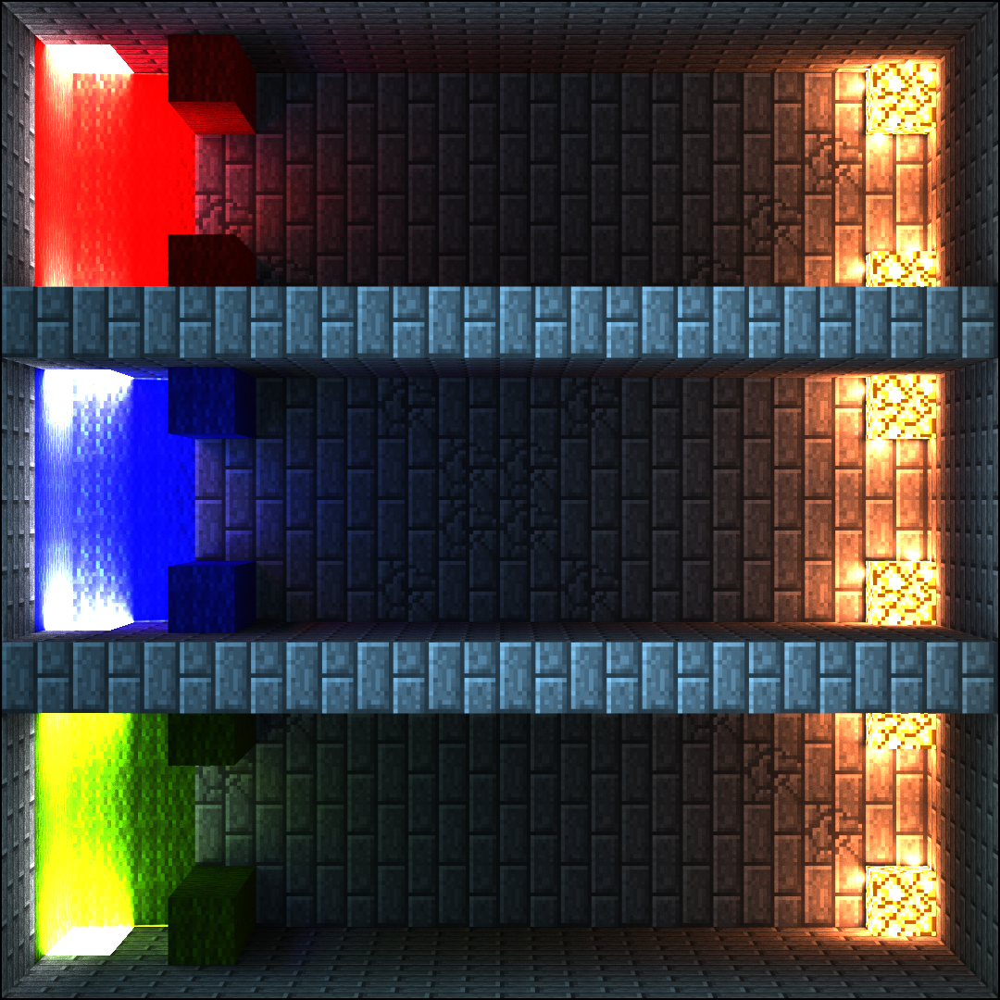

# Denoising
{: .no_toc }

## Table of contents
{: .no_toc .text-delta }

1. TOC
{:toc}

---

## Super Sample Downscaling Denoising

[A technique first covered back in October 2014](https://www.reddit.com/r/chunky/comments/2kljk1/proof_of_method_the_downscale_test/).

The basic premise is to render a scene at a higher than target resolution, apply a Gaussian blur to the whole image, and then scale it down to the target resolution. The noise is still present but given the higher resolution each pixel of noise takes up less screen space compared to the “noiseless” data from the sun/sky. Blurring and scaling to target resolution should result in better results then rendering at native resolution.

### Original examples

540p

1080p

2160p

4320p

---

## Split Pass Denoising

[An approach llbit showcased in September 2015](https://www.reddit.com/r/chunky/comments/3kwknl/results_of_some_quick_experiments_with_selective/).

By rendering the scene twice, first with a “Sunlight Pass” to 200 SPP and then a “Raw Emitter Pass” to 400 SPP. The noisy emitter pass could then be filtered with a Selective Gaussian Blur in GIMP and then combined. Comparing a typical 400 SPP Sunlight + Raw Emitter image to the Sunlight + Filtered Emitter image it was seen that the lighting was softer and there was less noticeable noise.

### llbit's example

Sunlight pass at 200 SPP

Emitter pass at 400 SPP

Filtered emitter pass

Sunlight + filtered emitter pass

Typical 400 SPP render

---

## Multi-plane

A technique which I never released; Covers rendering a scene with a clear and distinct fore and background elements. By rendering the complete scene with emitters at 0.01, emitters would light up but not emit visible light. This would lead to zero emitter noise in the distance. Meaning lower SPPs could be used for this element. Foreground element should be loaded with a reduced number of chunks, to speed up rendering speed, with the chosen emittance. With a careful selection of Chunks and combination of the two elements a reasonable result can be achieved.

### Example

Foreground selection of 76 chunks

1024 SPP @ 932k SPS - aka it's fast

Background selection of 1877 chunks

128 SPP @ 482k SPS - aka it's slow

Crude composite

The key issue with this technique is that the lighting information in the foreground element would not completely match the background. Further mitigations would be to instead combine this Multi-plane technique with Split Pass to further speed up rendering and retain bounce lighting from Sun/Sky present within the background pass. Using Split Pass would also mean that less effort is required to recombine the completed results.

---

## AI Based Denoising

[First showcased by u/StaysAwakeAllWeek in Nov 2018](https://www.reddit.com/r/chunky/comments/a0o15p/this_simple_aibased_denoiser_tool_for_nvidia_gpus/), this was the first time an AI based denoiser was mentioned on r/Chunky. Unfortunately it was limited to just Nvidia GPUs. A few months later I discovered Intel’s Open Image Denoise; an AI based denoiser that works on any CPU with SSE4.1 support. The rest is history.

### Example
| SPP  | RAW                                          | OIDN                                                  |
|------|----------------------------------------------|-------------------------------------------------------|
| 512  |   |   |
| 2048 |  |  |
| 4096 |  |  |
| 8192 |  |  |

As some of you may have noticed while AI based denoisers work wonders there are a few issues with the outputted images. Noteworthy visual artifacts are the deformed blocks, blurred textures, and the painted effect you can often see. Below you can see an extreme case where a 32 SPP scene lit mostly by emitters was denoised.

### Example of painted effect

Some of these issues can be resolved by using leMaik’s Denoising Plugin which has the ability to, not only to automatically denoise a scene once the target SPP is reached but, render auxiliary feature images / AOVs (Arbitrary Output Variables) to provide additional information to the denoiser.

### Albedo Map

The Albedo map is a feature image that provides the largest quality bump to the denoiser. It’s basically just a representation of the texture information within the scene independant of shading (lighting) or viewing angle. This map tends to help restore texture details.
**IMPORTANT** - Make sure you **disable all post processing** and set **exposure to 1**. The Denoiser plugin, at the time of writing, doesn’t exclude post processing and it can destroy the albedo.

### Normal Map

The Normal map is another feature image that can help. In order to use a Normal map you need to provide the Denoiser with the Albedo map first. This map tends to help restore block shape.

---

## Split Pass + AI Denoising

For some scenes where we have access to both Sun/Sky light and Emitters.

As many would probably know by now; Scenes which receive most of their lighting directly from the Sun or Sky generally do not require SPPs past 1000 SPP unlike scenes with emitters that can require 8000 SPP or more. Subjecting the whole scene to an AI based denoiser when it is not necessary is what this combination technique aims to solve.

We take llbit’s Split Pass Denoising and instead of feeding the emitter pass through a simple Gaussian blur we use an AI based denoiser like Optix or OIDN. Given the Sun, Sky, and Fog pass is not put through the denoiser any fine details or grain from this pass will be kept. This is most noticeable when looking at the fog. Any part of the scene that does not receive lighting from the  Sun, Sky, and Fog pass but instead is lit from the emitter pass will still unfortunately experience a painted effect.

Put simply: Render the Sun, Sky, and Fog in one pass. In another pass render the emitters and denoise it with an AI base denoiser like Open Image Denoise or Nvidia Optix. These two passes can be combined using GIMP by setting the layer mode to Screen.

### Example 1

Sun + Sky + Fog Pass at 256 SPP

Raw Emitter Pass at 2048 SPP 

AI denoised Emitter Pass

Combined SSF + E_dn using GIMP and layer mode set to screen

### Example 2

Sun + Sky + Fog Pass at 256 SPP

Raw Emitter Pass at 2048 SPP 

AI denoised Emitter Pass

Combined SSF + E_dn using GIMP and layer mode set to screen

### A simple proof of concept with Layer mode: Screen

Below is a showcase of further subdividing light sources into different passes and the combined composite VS a typical render. This is merely to showcase that splitting render passes and combining in post can produce equivalent results to a typical render. Of course subdividing a scene into this many passes and rendering to such a high SPP is not required for Split Pass + AI Denoising.

| Sun pass                                                  | Sky pass                                                     | Emitter pass                                                     |
|:----------------------------------------------------------|:-------------------------------------------------------------|------------------------------------------------------------------|
|  |  |  |
| SSE_Comp                                                  |                                                              | Typical bake                                                     |
|    |                                                              |      |