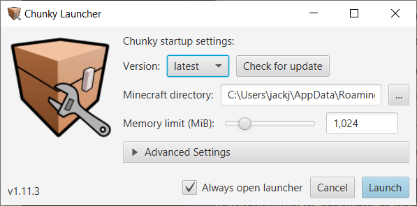
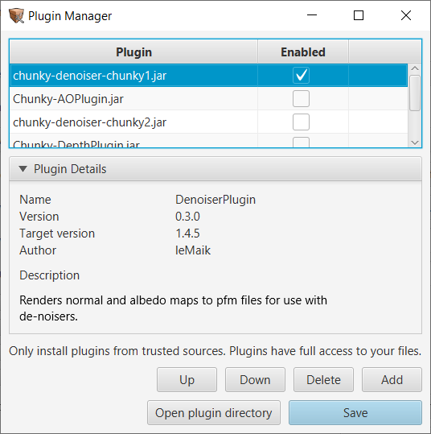

# Chunky Launcher
{: .no_toc }

## Table of contents
{: .no_toc .text-delta }

1. TOC
{:toc}

---

## Chunky Launcher

`Version select` - Drop down list which allows you to pick a downloaded Chunky version.

`Check for update` - Checks for updates on chosen update channel.

`Memory limit (MiB)` - Default is 1024 MiB but it is highly recommended that you raise this value to better reflect the amount of memory in your system. Please take into account that the OS and other applications will also require some memory so don't over set this. If you cannot raise this past 2000 MiB double check your Java installation is 64 bit.

---

## Advanced Settings

`Update Site` - Changes source for updates.

- `http://chunkyupdate.llbit.se/` should be used to obtain Chunky 1.X for Minecraft 1.12.

- `http://chunkyupdate2.llbit.se/` is for llbit's Chunky 2.0 for Minecraft 1.13 however you will need to enable snapshots to get the latest version, `2.0beta6`, else you will be stuck with an older version.

- `http://chunkyupdate.lemaik.de/` is for leMaik's Chunky 2.1 which offers improved Minecraft 1.13 support, over llbit's Chunky 2.0, in addtion to 1.14, 1.15, and 1.16 snapshot support.

`Java Runtime` - Allows you to see and change the Runtime used for Chunky. Does not change the runtime used for the Launcher.

`Java options` -

`Chunky options` - Some advanced stuff...

`Enable debug console` & `Verbose logging` - The debug console is a seperate window that runs when you launch Chunky. As the name implies it is useful for debugging issues with Chunky and combined with Verbose logging, which enables addtional debug information, can be helpful in fixing bugs and crashes.

`Download snapshots` - Snapshots are nightly/alpha/beta builds of Chunky, depending on the update site used, and may be unstable.

`Manage plugins` - The Plugin manager can be used to manage installed plugins.

---

## Java options

- `-DlogLevel` - ERROR, WARNING, INFO - Default is WARNING which will mean Chunky shows warnings for missing items. ERROR should disable missing item warnings.

- `-Dchunky.useLegacyOctree=true` - Disables new octree [see PR #604](https://github.com/llbit/chunky/pull/604). If you run into any issues with the new octree this will fix it. Please also report the issue on GitHub.

---

## Chunky options

- `-tile-width <NUM>` - Modifies the frame subdivision size per worker thread. Can potentially provide a boost to render speed or, if set too high, reduce render speeds. [More testing is needed](https://jackjt8.github.io/ChunkyGuide/docs/helpwanted/helpwanted.html#explore-different-tile-width-sizes-for-potential-speedups).
